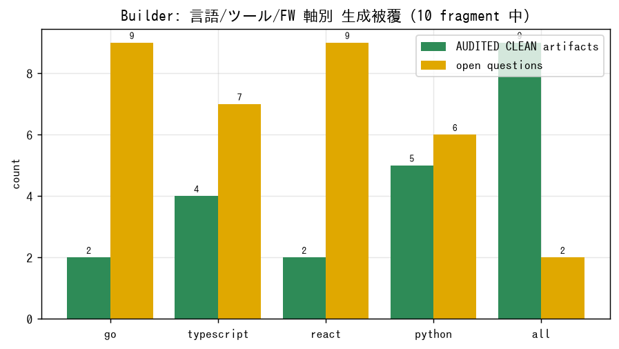

# claim-metrics

Claim プラットフォーム（**Builder → Security → Auditor**）の統合検証で取得した
**統計・計測の単一集約先**。各検証ランは「案件を 1 件回し、各機能の動作・異常・改善点を
数値で記録する」dogfooding の証跡として `runs/<date>/` に保存する。

## 何を測るか

- **案件内容** と、そこから抽出できる数値（fragment 数・分類・artifact・open question 等）
- **言語 / ツール / フレームワーク**別の被覆（薄い軸の可視化）
- **Auditor 自己適用**（自プロダクト群＋ LLM 主張）の claim 数・severity・exit code
- **既存案件テストコーパス**の precision / recall / f1
- **エラー / 修正 / 程度**（異常の検出・分類・対応状況）
- **使用エージェント数**（Claude Code サブエージェント / Auditor agents / Builder specialists）

## ランの索引

| 日付 | 案件 | 概要 | レポート |
|---|---|---|---|
| 2026-06-14 | `claim-feedback` | Builder→Security→Auditor 統合 + 自己適用 + LLM 主張監査。薄い軸（Go/TS/React）検証 | [STATISTICS.md](runs/2026-06-14/STATISTICS.md) / [stats.json](runs/2026-06-14/stats.json) |

## 可視化

グラフは [`runs/2026-06-14/charts/`](runs/2026-06-14/charts/)（PNG）、ダッシュボードは
[`runs/2026-06-14/dashboard.html`](runs/2026-06-14/dashboard.html)（依存ゼロの静的 HTML）。
再生成: `python3 scripts/make_charts.py runs/2026-06-14`（matplotlib のみ）。



## ハイライト（2026-06-14）

- テスト横断: **2482 passed / 0 failed**（Auditor 2089・Builder 384・Security 9）
- Builder 分類率 **90%**（9/10 fragment が ①–⑦ 到達）
- Auditor 自己適用 4 リポ: real defect **0**（検出 claim 20 は全て types-PyYAML 未導入の低 severity）
- 既存案件テストコーパス: **51 ケース P=1.00 / R=0.889 / F1=0.941**、realworld 7 ケース 完璧
- 異常 **6 件**検出（うち環境修正で即解消 2・設計どおり 1・改善提案 3）

## ディレクトリ構成

```
runs/2026-06-14/
  STATISTICS.md      ← 人間向け統計レポート（本体）
  stats.json         ← 機械可読集計
  case/requirements.md   ← 案件定義
  builder/           ← Builder RunRecord（言語/ツール/FW 軸別 JSON）
  auditor/           ← Auditor 自己適用 JSON（4 リポ）
  security/          ← Security ループの計測（該当時）
  llm-audit/         ← Auditor を LLM（本エージェント）の主張に適用した結果
```

## 再現

```bash
# 依存（本検証で導入）
pip install -e Claim-Auditor -e Claim-builder -e Claim-Security-
pip install jsonschema pytest types-PyYAML

# Builder（案件を回す）
claim-build build claim-metrics/runs/2026-06-14/case/requirements.md --record /tmp/rec.json

# Auditor 自己適用
cd Claim-Auditor && claim-audit case --case .claim-auditor/case.yaml --execute --format json
```
