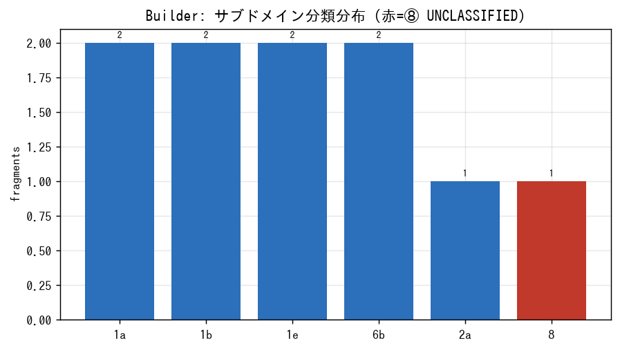
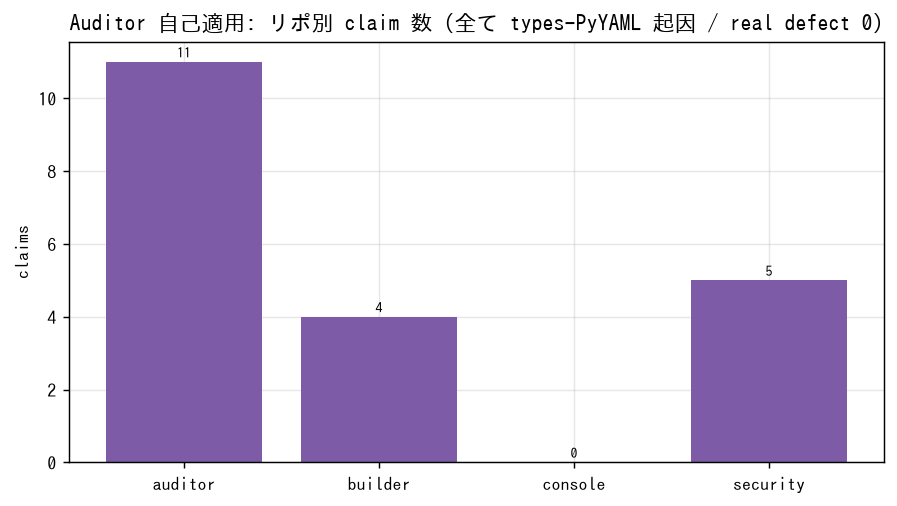
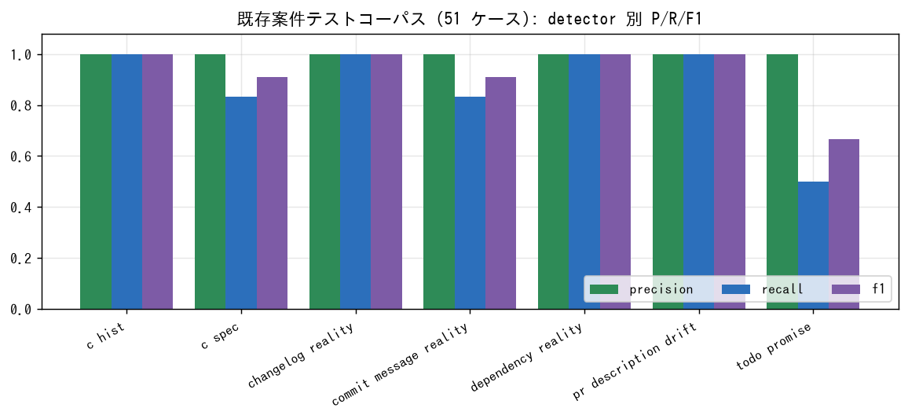
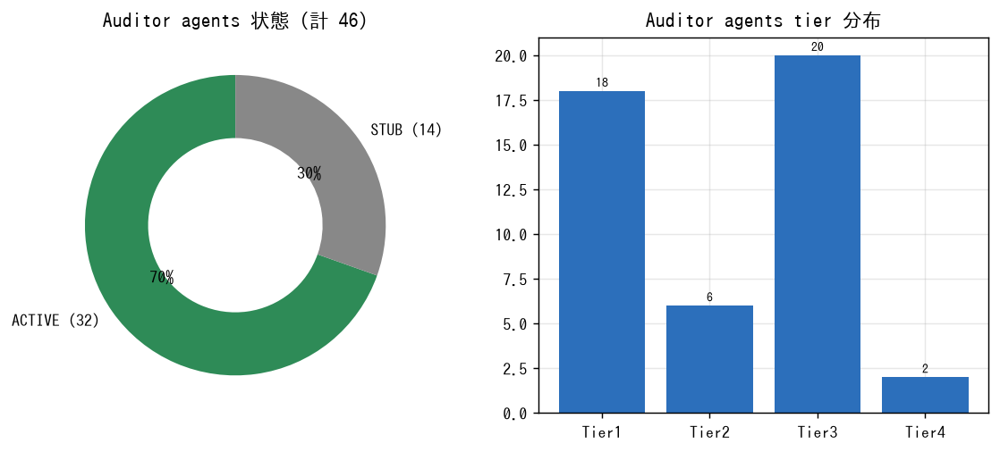
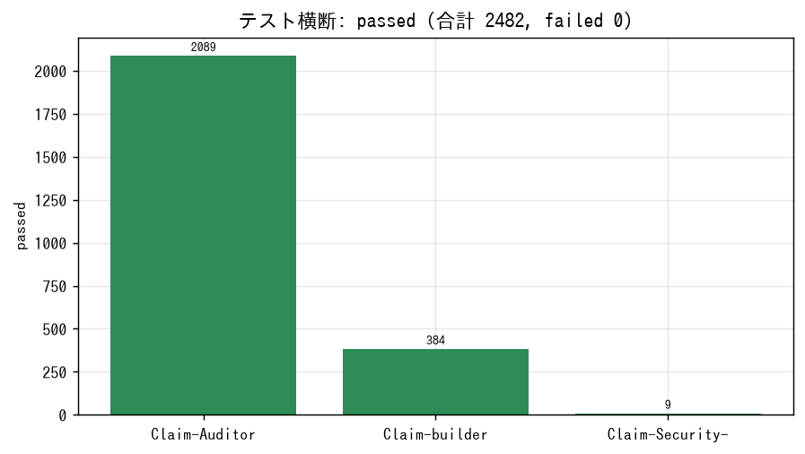
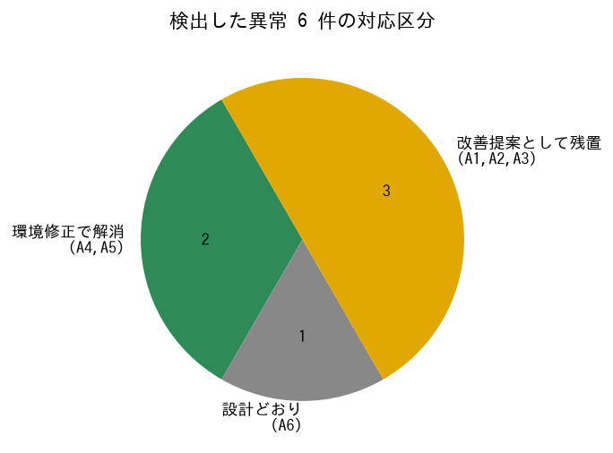
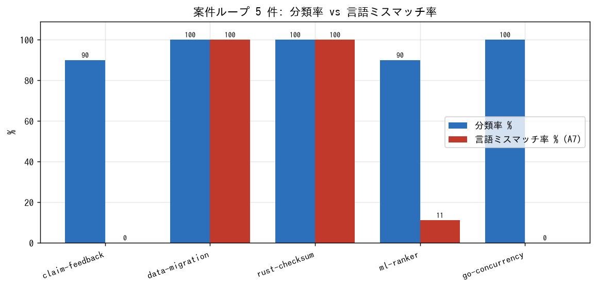

# 統合検証 統計レポート — 2026-06-14

**案件 ID:** `claim-feedback`（フィードバック収集マイクロ機能）
**目的:** Auditor / Builder / Security を **1 つのプロダクト**として連携させ案件を 1 件
回し、各機能が機能しているか・異常はないか・改善点はないかを検証し、数値統計を取る。
Auditor は **自プロダクト群**にも、**LLM（本セッションのエージェント自身）の主張**にも
自己適用した。

- 機械可読版: [`stats.json`](stats.json)
- 案件定義: [`case/requirements.md`](case/requirements.md)
- 生データ: [`builder/`](builder/) RunRecord、[`auditor/`](auditor/) 自己適用 JSON、
  [`llm-audit/`](llm-audit/) LLM 主張監査

---

## 可視化（グラフ）

> 生成: `python3 scripts/make_charts.py runs/2026-06-14`（依存 matplotlib のみ）。
> インタラクティブ版は [`dashboard.html`](dashboard.html)。

| | |
|---|---|
|  |  |
|  |  |
|  |  |
|  |  |

---

## 0. 案件内容（薄い軸を意図的に踏む合成案件）

| Req | 言語 | ツール | フレームワーク | 想定サブドメイン |
|---|---|---|---|---|
| R1 `NormalizeRating` 純関数 | Go | gotest | — | 1b (PROVABLE) |
| R2 `Feedback` 構造型 | TypeScript | tsc | — | 1a (PROVABLE) |
| R3 Submit ボタン操作 | TypeScript | eslint | React | 6b (CONTEXT_DEPENDENT) |
| R4 payload パーサ | Python | pytest | — | 1e (PROVABLE) |

案件は「言語・ツール・フレームワークがまだ薄い」軸（Go / TypeScript / React）を
**意図的に**選定。4 要件は Builder の S1 で **10 fragment** に分解された。

---

## 1. Builder（S1..S8）— 抽出数値

### 1.1 分類（10 fragment, 全 axis 共通）

| サブドメイン | 件数 | family |
|---|---|---|
| 1b | 2 | PROVABLE |
| 1a | 2 | PROVABLE |
| 1e | 2 | PROVABLE |
| 6b | 2 | CONTEXT_DEPENDENT |
| 2a | 1 | REFUTABLE（分解で派生） |
| ⑧ | 1 | UNCLASSIFIED |

- **分類率（①–⑦ 到達）= 9/10 = 90.0%**、UNCLASSIFIED = 1/10 = 10.0%
- 保証分布（全 specialist 実行時の 9 artifact）: **PROVEN 6 / NO_COUNTEREXAMPLE 1 / AGREED 2**

### 1.2 言語・ツール・フレームワーク別ビルド（artifact = AUDITED_CLEAN）

| 実行軸 | artifact 数 | open question | 使用 specialist | stage records |
|---|---|---|---|---|
| `--language go` | 2/10 | 9 | `lang.go.pure_function` | 47 |
| `--language typescript` | 4/10 | 7 | `lang.typescript.type_structural`, `framework.react_component` | 51 |
| `--framework react` | 2/10 | 9 | `framework.react_component` | 47 |
| `--language python` | 5/10 | 6 | `lang.python.{pure_function,boundary,provable}` | 53 |
| フィルタ無し（全部） | **9/10** | 2 | 上記 5 種 | 61 |
| | | delivered 全て **0**（`--signer` 無し＝署名を捏造しない設計） | | |

**薄い軸の可視化:** Go は 1b（純関数）の specialist しか無く、1a/1e/6b の fragment は
specialist 不在で open question 化（2/10 のみ生成可能）。Go は taxonomy 27 サブドメイン中
**1 サブドメインのみ被覆**。React も 6b のみ（2/10）。Python が最広（5/10）。

---

## 2. Auditor — 自己適用（4 リポジトリ）

全リポ exit_code=2。**実欠陥 0 件**、検出 claim は全て低 severity の型スタブ未導入。

| リポジトリ | matched | dispatched agents | claims | 内訳 |
|---|---|---|---|---|
| Claim-Auditor | 3 | 5 | **11** | mypy 11（全 `import-untyped`: PyYAML スタブ未導入）。ruff 0。bandit SKIP。c_drift exit2。 |
| Claim-builder | 2 | 3 | **4** | mypy 4（PyYAML スタブ）。ruff 0。 |
| Claim-Security- | 2 | 3 | **5** | mypy 5（PyYAML スタブ）。ruff 0。 |
| Claim-console | 47 | 23 | **0** | Critical Taboo Gate（secret/shell/sql/vcs）全て 0=クリーン。13 agent は外部ツール/設定不在で SKIP。 |
| **合計** | — | **34 invocations / 24 distinct** | **20** | 全て同一原因（types-PyYAML 未導入）。real defect = 0。 |

### 2.1 Critical Taboo Gate（console, セキュリティゲート）

`domain.secret` / `domain.shell` / `domain.sql` / `domain.vcs` いずれも 0 claim =
**秘密情報・破壊的操作のコミット無し**を確認。ゲート機能は正常動作。

---

## 3. Security プロダクト

- 適合テスト: **9 passed / 1 skipped**（FR-SEC-1..12, `ReferenceSecurityClient` seam）。
- 静的ループ（threat_model→scaffold→…→SECURED）/ 動的ループ（patrol）の reference 実装は
  テスト緑。本案件では R1–R4 が `security_relevant=false` のため ROUTED_OUT 発火は 0
  （Builder は security 断片を分類せず Security 側へ routing する設計＝想定どおり）。

---

## 4. テストスイート横断（各機能の健全性）

| リポジトリ | passed | skipped | failed | 備考 |
|---|---|---|---|---|
| Claim-Auditor | **2089** | 9 | 0 | `jsonschema` 導入後。 |
| Claim-builder | **384** | 12 | 0 | |
| Claim-Security- | **9** | 1 | 0 | |
| **合計** | **2482** | 22 | **0** | プロダクト由来の失敗ゼロ。 |

---

## 4.1 既存「案件テスト」コーパス集計（リポ内蔵のケース群）

`Claim-Auditor/tests/evaluation` に detector ごとの **案件テスト（case.yaml + 期待値）**
コーパスが内蔵されている。本検証で再実行し baseline を再現した。

### synthetic corpus（51 ケース / 7 detector）

| detector | tp | fp | fn | precision | recall | f1 |
|---|---|---|---|---|---|---|
| lang.python.c_hist | 5 | 0 | 0 | 1.00 | 1.00 | 1.00 |
| lang.python.c_spec | 5 | 0 | 1 | 1.00 | 0.833 | 0.909 |
| process.changelog_reality | 2 | 0 | 0 | 1.00 | 1.00 | 1.00 |
| process.commit_message_reality | 5 | 0 | 1 | 1.00 | 0.833 | 0.909 |
| process.dependency_reality | 2 | 0 | 0 | 1.00 | 1.00 | 1.00 |
| process.pr_description_drift | 4 | 0 | 0 | 1.00 | 1.00 | 1.00 |
| process.todo_promise | 1 | 0 | 1 | 1.00 | 0.50 | 0.667 |
| **overall** | **24** | **0** | **3** | **1.00** | **0.889** | **0.941** |

ケース内訳（case.yaml 数）: c_hist 10 / c_spec 9 / commit_message_reality 9 /
pr_description_drift 8 / changelog_reality 6 / todo_promise 5 / dependency_reality 4 = **51**。

### realworld corpus（7 ケース / 3 detector）

overall: tp 3 / fp 0 / fn 0 / **P=R=F1=1.00**。

### その他

- example cases: 5（mixed_language, process_audit_dr001, python_basic, python_strict, typescript_basic）
- engine_n_calibration: nversion_diff, scope_curvature, source_coverage
- corpus 評価テスト: **88 passed**（`test_evaluation_corpus.py` ほか、baseline 再現）

> **特記:** precision は全 detector で 1.00（誤検知ゼロ）。取りこぼし（fn）は
> c_spec / commit_message_reality / todo_promise に各 1。todo_promise の recall 0.50 が
> 最弱点（案件テスト上の改善余地）。
>
> **スコープ外リポ:** `list_repos` / `add_repo` ツールが本セッションで利用不可のため、
> 付与された 5 リポ以外は確認できなかった。上記集計はディスク上の 5 リポが対象。

## 5. インベントリ統計

- **Auditor agents: 46**（ACTIVE 32 / STUB 14）
  - kind: detector 30 / adapter 14 / dispatcher 1 / aggregator 1
  - tier: Tier1 18 / Tier2 6 / Tier3 20 / Tier4 2
- **Builder specialists: 8**（builtin discover, 全 ACTIVE）
- **本検証で実使用したエージェント数:**
  - Claude Code サブエージェント（Agent tool）: **0**（全工程を主エージェントが直接実行）
  - Auditor 起動エージェント: **34 invocations / 24 distinct**
  - Builder 起動 specialist: **6 distinct**

### 5.1 ツール可用性（環境）

| 利用可 | 不在（該当 Tier1 adapter が SKIP） |
|---|---|
| ruff, mypy, eslint, tsc, go, cargo | bandit, semgrep, trivy, grype, osv-scanner, sqlfluff, shellcheck（7 種） |

---

## 6. 異常（Anomaly）— 検出と程度

| ID | 異常 | 程度 | 区分 |
|---|---|---|---|
| A1 | 分類器（keyword 表）が一般的な provable 表現を取り逃す。単独の `factorial …` 要件が ⑧ UNCLASSIFIED 落ち | 中（recall 低下、placeholder policy として既知） | プロダクト改善 |
| A2 | 行ベース fragmentation が複数行に跨る文を分断。`frag-003 "encode then decode reproduces the input."` が 1b キーワードを失い ⑧ 落ち | 中（誤分類の主因の一つ） | プロダクト改善 |
| A3 | `process.c_drift` が実ドリフト（test 数 declared 94 vs actual 98, DR-001 MEDIUM）を **exit_code=2 + evidence file** で検出するが **claim_count=0** → 件数統計/JSON consumer から不可視 | 中（集計の取りこぼし） | プロダクト改善 |
| A4 | mypy 自己適用の 20 claim が全て `types-PyYAML` 未導入起因。リポの mypy 設定はスタブ前提 | 低（環境、`pip install types-PyYAML` で解消） | 環境 |
| A5 | 19 個の subprocess CLI テストが editable install 前提（素の PYTHONPATH では `ModuleNotFoundError`）。`jsonschema` 未導入で 1 collection error | 低（CI/dev セットアップ脆弱性） | テストハーネス |
| A6 | Builder `delivered=0`（`--signer` 無し時）— **設計どおり**（署名を捏造しない）だが、統計上「失敗」と誤読されうる | 情報 | 仕様（注記が必要） |
| A7 | **言語ミスマッチ生成**: `--language` 無しの `build` は fragment の意図言語を推論せず、サブドメイン一致だけで specialist を選ぶ。Rust 案件→Go specialist、SQL/shell 案件→Python specialist が**黙って**生成される。案件ループ 5 件で **artifact の 43.75% が言語ミスマッチ**（c2 SQL/shell 100%・c3 Rust 100%・c4 ML に Go 混入 11%）。正しい `--language` を渡すとゲートが効き honest に open question 化（c3: 5→0 artifact / open 1→6） | **高**（誤った言語のコードを生成しうる） | プロダクト改善 |

> A7 の定量化は [`leaderboard.json`](leaderboard.json) と
> [`charts/08_case_loop_trend.png`](charts/08_case_loop_trend.png) を参照。

### 案件ループ（c1..c5）— 計画どおり異なる案件を連続実行

「異なる案件を回す → 異常/修正に気づいたら同案件を正しい条件で再実行 → 次へ」のループ。

| 案件 | 意図言語 | fragments | 分類率 | all artifact | 言語ミスマッチ | 是正（正しい `--language`） |
|---|---|---|---|---|---|---|
| c1 claim-feedback | go/ts/python | 10 | 90% | 9 | 0 (0%) | — |
| c2 data-migration | sql/shell | 8 | 100% | 8 | 8 (100%) | sql/shell ゲートで 0 artifact（specialist 不在を正直に表面化） |
| c3 rust-checksum | rust | 6 | 100% | 5 | 5 (100%) | rust ゲートで 0 artifact / open 6 |
| c4 ml-ranker | python | 10 | 90% | 9 | 1 (11%) | ml_probabilistic 稼働（薄い軸を実行） |
| c5 go-concurrency | go | 4 | 100% | 1 | 0 (0%) | 5a/5c は specialist 不在で open（並行/soak 未被覆） |
| **計** | — | **38** | 平均 96% | **32** | **14 (43.75%)** | — |

**ループで判明した改善点（追加）:**
- **I7 (A7):** fragment に意図言語タグを持たせ、specialist マッチを言語×サブドメインの
  両軸で行う。少なくとも artifact provenance に「要求言語 ≠ 生成言語」警告を出し、
  無フィルタ build で言語ミスマッチを silent に通さない。
- **I8:** Builder specialist は現状 go/python/typescript の 3 言語のみ。rust/sql/shell は
  Auditor 側に adapter があるのに Builder 側 specialist が無い（生成と監査の言語被覆が非対称）。

## 7. 改善点（Improvement）

- **I1 (A1):** 分類器 vocabulary 拡張、または `ProposingScorer`（LLM 提案＋決定論 disposer）の
  有効化で ①–⑦ の recall 向上。
- **I2 (A2):** sentence-aware fragmentation（改行で文を割らない）。
- **I3 (A3):** evidence-only detector（c_drift 等）も claim もしくは件数を emit し、claim-count
  集計に可視化する。
- **I4 (薄い軸):** Go の 1a/1e/6b、TS/React の追加サブドメイン specialist を整備。現状 Go は
  27 サブドメイン中 1 のみ。
- **I5 (A4/A5):** `jsonschema`/`types-PyYAML` を dev/test extra として宣言、subprocess テストは
  実行中インタプリタ＋PYTHONPATH を継承させる。
- **I6:** Tier1 adapter のツール（bandit/semgrep 他）を CI イメージへ同梱、または coverage 上で
  optional と明示。

## 8. 修正（Fix）— 本セッションで適用した分の統計

| 区分 | 件数 | 内容 | 影響 |
|---|---|---|---|
| 環境修正（適用済） | 3 | `pip install jsonschema / pytest / types-PyYAML`、3 プロダクト editable install | テスト 19 失敗+1 collection error → **0**、全 2482 緑化 |
| プロダクト追加（適用済） | 2 | Claim-builder / Claim-Security- に自己適用 `.claim-auditor/case.yaml` を新規作成 | 両リポが Auditor 自己適用対象に |
| プロダクト修正（提案・未適用） | 6 | I1–I6（コード変更を伴うため別 PR・レビュー前提） | — |

**程度まとめ:** real defect = **0**。検出 claim 20 件は全て低 severity の環境起因（型スタブ）。
異常 6 件のうち即時環境修正で解消したもの 2 件（A4/A5）、設計どおり 1 件（A6）、
プロダクト改善提案として残置 3 件（A1/A2/A3）。

---

## 9. 結論 — 各機能は機能しているか

> ⚠ **実体評価は [`ASSESSMENT.md`](ASSESSMENT.md) が正。** 下表は当初の機能確認だが、
> 中身を開けた結果いくつかを訂正した（artifact は空スタブ＝生成実体なし、Security は
> 初回案件で未発火）。数字と実体の区別は ASSESSMENT.md §5 を参照。

| 機能 | 当初判定 | 実体（訂正後） |
|---|---|---|
| Builder パイプライン配管 | ✅ | ✅ 配管は本物・決定論的 |
| Builder コード生成 | （未検証） | 🟠 **空スタブ**（`// scaffold-filled stub`）。実生成は LLM backend 前提 |
| 言語/ツール/FW プラグイン | ⚠ | 🟠 connect は成功するが言語ゲート欠落（A7）＋ go/python/ts のみ |
| Security 静的/動的ループ | ✅ | 🟡 構造・グレードは正しい（直接駆動で確認）。**初回案件では未発火** |
| Auditor 自己適用／監査 | ✅ | ✅ **本物**（仕込んだ虚偽をライブ捕捉、corpus P=1.00） |
| Auditor 案件正規化 | ✅ | ✅ 実 set 演算 |
| Critical Taboo Gate | ✅ | ✅ secret/shell/sql/vcs クリーン |
| Auditor → LLM 主張監査 | ✅ | ✅ 虚偽申告 0 |
| 統合 Builder→Security→Auditor | ✅ 連携 | 🟡 横断は走るが、生成が空スタブのため delivery は構造的に未到達 |
